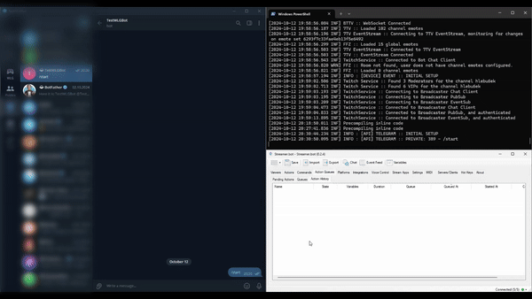
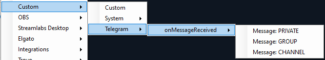

# Integration: Telegram Messenger

- [Discord: Link to Integration Discussion](https://discord.com/channels/834650675224248362/1294740972307091589)



# Installation
For usig it, Telegram Bot needs to be created, which will allow to use Telegram API:
1) Open Telegram BotFather, to create Telegram Bot account
   * BotFather link: https://t.me/botfather
2) Type `/newbot` command in chat with [BotFather](https://t.me/botfather)
   * follow instructions provided by BotFather
   * API Token will be created at the end, which is required
3) copy below import code and paste into Streamer.Bot
   ```text
   import code
   ```
   ***NOTE:***\
   *if you want to just copy [C# code](./TelegramAPI.cs) instead make sure you rename class*\
   *Class name should be: `public class CPHInline {}`*
4) put your API Token into integration
   * copy `API Token` generated with BotFather
   * paste it into `[API] Telegram` Action, `tg.token` property
5) Restart StreamerBot or just hit Test Trigger to execute the code, so Telegram Triggers are registered.
6) Invite your bot created with BotFather into Group/Channel
   * don't forget to make it **Admin**, to be able to read messages
7) Done :) now you can receive messages/commands and do actions

# How to Use
1) Complete [installation](#installation) first if it's not yet done
2) create any action in StreamerBot
3) in triggers section `right click` -> `Custom` -> `Telegram` -> `select trigger you would like`
   
4) don't forget to invite bot into GROUP/CHANNEL and make it `Admin`
5) have fun! 🙂

# Available Methods
* #### sendMessage
  Executes method to Send message to Telegram GROUP/CHANNEL/PRIVATE chat\
  **IMPORTANT**: `message.text` should follow specific format style\
  Format Style specified in `tg.parse.mode` property of `[API] Telegram` Action\
  read more about available format styles:
  * MarkdownV2: https://core.telegram.org/bots/api#markdownv2-style
  * HTML: https://core.telegram.org/bots/api#html-style
  * Markdown: https://core.telegram.org/bots/api#markdown-style
  ```text
  message.chat.id       - mandatory - target chat
  message.text          - mandatory - content to send
  message.file.path     - optional  - can be url or system path
  message.thread.id     - optional  - thread id if chat.id is thread
  
  to be attach buttons to message, use pattern: message.button.#
  where # - is the number of button from 1 to 9
  
  message.button.1.text - optional  - button text content
  message.button.1.url  - optional  - url where it leads to
  ```

# Changelog
* 1.4.0 - **migration to GitHub**: [Pull Request: 14](https://github.com/madbuilds/sbot/pull/14)
* 1.3.0 *(19.01.2025)* - **parse mode parameter**
* 1.2.0 *(18.10.2024)* - **extend of sending functionality**
* 1.1.1 *(17.10.2024)* - [FIX] variable type fix
* 1.1.0 *(17.10.2024)* - **method created**
* 1.0.0 *(12.10.2024)* - **initial version**